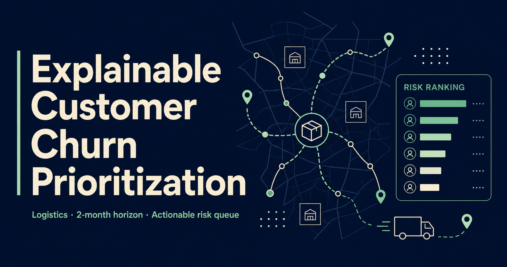
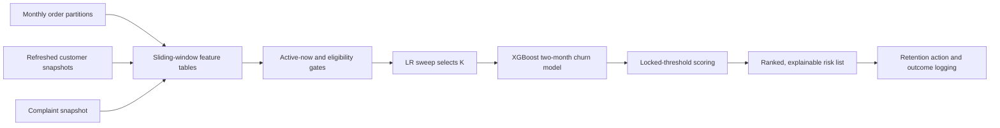

# Explainable Customer Churn Prioritization for Logistics

[](https://github.com/dangssss/Showcase_Vnpost_churn_ver1/actions/workflows/deploy-pages.yml)

A recruiter-facing data science case study for a churn system that predicts which logistics customers are likely to leave within a two-month horizon, explains the behavioral signals behind each score, and converts those scores into a capacity-aware intervention queue.

**[Open the interactive showcase](https://dangssss.github.io/Showcase_Vnpost_churn_ver1/)** · **[Read the full case study](https://dangssss.github.io/Showcase_Vnpost_churn_ver1/case-study/)**



> **Portfolio-safe disclosure:** every customer on the site is synthetic. Model metrics are reproducible notebook outputs (seed 42); system claims are traceable to code; business impact is a visibly labeled planning scenario with explicit assumptions, never an unaudited revenue claim.

## What powers the demo

The showcase is driven end to end by one notebook run, `VNPost_Churn_Prediction_Final_Demo.ipynb`:

1. Generate a 1,400-customer × 22-month synthetic cohort mirroring the production schema (`bccp_orderitem_YYMM` partitions, lifetime snapshots, `Label.label_YYMM` future-month labels) — 30,800 raw rows.
2. Build sliding-window feature tables `cus_feature_{K}m_YYMM_YYMM` for `K ∈ {3, 6, 9, 13}` with an active-now gate.
3. Run an elastic-net Logistic Regression sweep that selects `K = 13` + static profile features (validation F1 0.7145) — LR is the referee, not the final model.
4. Tune five XGBoost candidates on the selected dataset; `d6_regularized` wins on validation F1 0.7372.
5. Lock the decision threshold on validation (0.437), then score the untouched final month once: **F1 0.714 · precision 0.661 · recall 0.776 · AP 0.769 · ROC-AUC 0.913** (synthetic holdout, 1,340 active customers, confusion 915/121/68/236).
6. Export a ranked six-column risk list, gain-based feature importance and five guardrail asserts that must pass.

`data/export_notebook_artifacts.py` re-runs that pipeline deterministically, verifies every headline number against the notebook's printed output, and writes `app/notebook-artifacts.json` plus the downloadable CSVs — the site renders only exported artifacts.

## What recruiters can inspect

- The business decision, prediction horizon and leakage-safe temporal design
- The real LR sweep, XGBoost tuning table and locked-threshold holdout evaluation
- An interactive decision lab over the actual holdout scores: operating-threshold trade-offs, ranked queue, 22-month customer dossiers with business-rule evidence, and an outcome reveal per customer
- Explainability layering: gain importance from the notebook; production SHAP → eight structured reason buckets
- Production promotion gates, drift monitoring (PSI/KS), a typed CRM handoff, reason-to-action routing and closed-loop outcome measurement
- An assumption-based business-impact scenario that shows how contact coverage, retention lift, protected margin and action cost combine

## System at a glance



| Dimension | Operating choice |
| --- | --- |
| Prediction horizon | Two months |
| Sliding window | K = 13 months, selected by LR sweep |
| Demo cohort | 1,400 synthetic customers × 22 months (seed 42) |
| Demo holdout | F1 0.714 · ROC-AUC 0.913 at locked threshold 0.437 |
| Intervention capacity | ≈7,000 customers per scoring cycle |
| Model development | LR referee baseline → tuned XGBoost |
| Delivery environment | Python, PostgreSQL, Airflow and Docker |
| Evidence layers | Reproduced notebook · system implementation · operational playbook |

## Ownership

I owned problem formulation, label design, baseline and XGBoost modeling, temporal validation, threshold strategy, explainability, risk export, monitoring, production integration and the public notebook demo. Feature definitions and generation were completed in collaboration with the data engineering team.

## Repository map

```text
app/                              Interactive showcase and full case-study route
app/notebook-artifacts.json       Verified outputs exported from the notebook re-run
data/export_notebook_artifacts.py Deterministic notebook replication + artifact export
data/generate_synthetic.py        Legacy portfolio-safe sample generator
docs/case-study.md                Methodology, notebook demo results and ownership notes
public/notebook_risk_list.csv     Full 1,340-row holdout risk list from the notebook run
public/notebook_monthly_behavior.csv  22-month behavior for the dossier customers
tests/rendered-html.test.mjs      Static-export smoke tests
.github/workflows/                GitHub Pages build and deployment
```

## Run locally

Prerequisite: Node.js 22.13 or newer.

```bash
npm ci
npm run dev
```

Open `http://localhost:3000`.

To regenerate the notebook artifacts (requires Python with numpy, pandas, scikit-learn and xgboost):

```bash
python data/export_notebook_artifacts.py app/notebook-artifacts.json public
```

The script re-runs the demo notebook's pipeline at seed 42 and fails loudly if any verified number drifts from the notebook's printed output.

To run the repository checks:

```bash
npm run lint
npm run build:pages
npm test
```

The static site is written to `out/`. A push to `main` triggers the GitHub Pages workflow.

## Honesty contract

- Synthetic-run metrics are always labeled as synthetic and reproducible.
- The production bundle reference (K = 13, validation F1 0.784) is shown only as context, never as a public performance claim.
- SHAP reasons, promotion gates and monitoring are tied to system code; CRM action/outcome fields are presented as the operating contract around that code.
- Business impact uses a disclosed scenario model. Model metrics, measured campaign lift and scenario economics are never blended into one claim.
