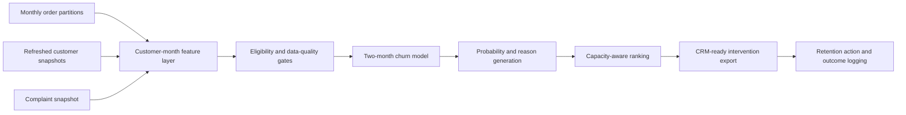

# Explainable Customer Churn Prioritization for Logistics

[](https://github.com/dangssss/Showcase_Vnpost_churn_ver1/actions/workflows/deploy-pages.yml)

A recruiter-facing data science case study for a churn system that predicts which logistics customers are likely to leave within a two-month horizon, explains the behavioral signals behind each score, and converts those scores into a capacity-aware intervention queue.

**[Open the interactive showcase](https://dangssss.github.io/Showcase_Vnpost_churn_ver1/)** · **[Read the full case study](https://dangssss.github.io/Showcase_Vnpost_churn_ver1/case-study/)**


> **Portfolio-safe disclosure:** all customer rows and downloadable CSVs in this repository are synthetic. Production code, customer data and unverified performance or business-impact figures are excluded. Those metrics remain explicitly marked as pending until approved run artifacts are available.

## What recruiters can inspect

- The business decision, prediction horizon and monthly label design
- Leakage-safe purged walk-forward validation and final temporal holdout
- Logistic Regression baseline, XGBoost development and model-promotion gates
- Probability- and capacity-based intervention policies for an approximately 7,000-customer queue
- Customer-level reasons derived from monthly behavioral changes and SHAP evidence
- A complete scoring demo: eligibility gates, policy controls, audit trail, ranked dossiers, take-action flow and CRM-ready export contract
- Backtesting, drift monitoring and production handoff design
- A detailed separation between my ownership and the feature-engineering collaboration boundary

## System at a glance



| Dimension | Design |
| --- | --- |
| Prediction horizon | Two months |
| Feature surface | 200+ lifetime and temporal signals |
| Intervention capacity | Approximately 7,000 customers per production run |
| Source shape | Monthly orders plus three continuously refreshed customer/service snapshots |
| Model development | Logistic Regression baseline and XGBoost candidate |
| Delivery environment | Python, PostgreSQL, Airflow and Docker |
| Current evidence status | System operated in production; approved performance and impact figures pending |

## Explanation contract

The demo uses the same business-language reason families as the operational risk export:

- Shipment volume below the previous three-month average
- Complaint volume above the previous three-month average
- Late-delivery rate above the previous three-month average
- Non-completion rate above the previous three-month average
- High shipment-volume volatility
- Average order value declining over time
- Reduced service diversity
- New customer with low tenure

Each reason is calculated from a six-month synthetic time series in the public demo. The data mirrors the temporal structure and calculation shape of the system; it is not claimed to reproduce the unknown production distribution.

## Ownership

I owned problem formulation, label design, baseline and XGBoost modeling, temporal validation, hyperparameter tuning, threshold strategy, explainability, risk export, monitoring and production integration. Feature definitions and generation were completed in collaboration with the data engineering team; feature engineering is therefore not presented as sole ownership.

## Repository map

```text
app/                              Interactive showcase and full case-study route
data/generate_synthetic.py        Deterministic portfolio-safe sample generator
data/sample/                      Six-month cohort and risk-export samples
docs/case-study.md                Methodology, architecture and ownership notes
public/                           Social card and downloadable synthetic CSVs
tests/rendered-html.test.mjs      Static-export smoke tests
.github/workflows/                GitHub Pages build and deployment
```

## Run locally

Prerequisite: Node.js 22.13 or newer.

```bash
npm ci
npm run dev
```

Open `http://localhost:3000`.

To regenerate the deterministic synthetic samples:

```bash
python data/generate_synthetic.py
```

To run the repository checks:

```bash
npm run lint
npm test
```

To reproduce the GitHub Pages static export locally:

```bash
GITHUB_PAGES=true \
GITHUB_REPOSITORY=dangssss/Showcase_Vnpost_churn_ver1 \
NEXT_PUBLIC_BASE_PATH=/Showcase_Vnpost_churn_ver1 \
npm run build:pages
```

The static site is written to `out/`. A push to `main` triggers the GitHub Pages workflow.

## Data contract

The raw production workflow combines:

- `bccp_orderitem_YYMM`: monthly-partitioned order items
- `cas_customer`: refreshed customer master snapshot
- `cas_info`: refreshed customer profile snapshot
- `cms_complaint`: refreshed complaint snapshot
- `Label.label_YYMM`: monthly outcome table used for training and backtesting

The public risk sample preserves only the export structure needed to demonstrate the decision workflow: scoring period, recent activity aggregates, churn probability and structured explanation reasons. No real identifier or customer value is included.

For the full design rationale and the evidence still required before publishing performance or impact claims, see [`docs/case-study.md`](docs/case-study.md).
