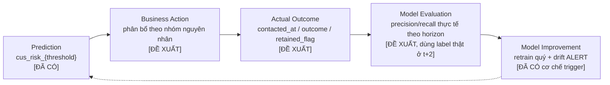
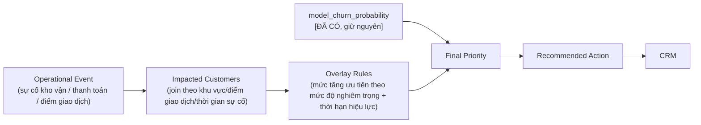

# Từ mô hình churn đến hệ thống vận hành: MLOps case study mở rộng

> **Cách đọc tài liệu này.** Mỗi luận điểm được gắn một nhãn trạng thái, dựa trên việc đọc trực tiếp mã nguồn ở nhánh `main` của repo `dangssss/Churn_Prediction_ver_1` (commit `adc0873`):
>
> - **[ĐÃ CÓ]** — có bằng chứng cụ thể trong code (tên file, hàm, hằng số) tại thời điểm audit.
> - **[SUY LUẬN]** — không có sẵn nguyên trạng, nhưng là phần mở rộng tự nhiên của một cơ chế đã tồn tại (ví dụ: có bảng nguồn nhưng chưa thấy JOIN; có module nhưng chưa được gọi).
> - **[ĐỀ XUẤT]** — hoàn toàn chưa tồn tại trong code, là thiết kế mới cần xây dựng nếu muốn đưa lên production.
>
> Tài liệu này không lặp lại các con số của bản demo notebook (1.400 khách hàng, 22 tháng, K=13, F1 0.714…) — đó là bằng chứng cho *phương pháp mô hình hoá*, còn tài liệu này nói về *kiến trúc vận hành* xung quanh mô hình, nên hai lớp bằng chứng cần tách biệt trong toàn bộ case study.

---

## 0. Tổng quan câu chuyện của case study

Câu chuyện xuyên suốt nên được kể theo một trục duy nhất — **"từ một xác suất thành một quyết định kinh doanh có thể đo lường được"** — chia làm ba lớp bằng chứng rõ ràng, và mọi phần bên dưới đều phải neo vào một trong ba lớp này:

1. **Lớp đã chứng minh được (đã có trong code):** mô hình hoá leakage-safe, cổng chấp nhận mô hình (promotion gate) với ngưỡng số cụ thể, pipeline sinh feature theo template SQL có khả năng tái sử dụng train/serving, cơ chế giải thích kết hợp SHAP + rule evidence, giám sát PSI/KS/risk-ratio theo scoring origin.
2. **Lớp thiết kế hợp lý (suy luận từ hạ tầng sẵn có):** DAG `ds_churn_model_scoring_only` đã tách biệt "chấm điểm" khỏi "huấn luyện lại" — đây chính là điểm neo tự nhiên để gắn overlay sự cố vận hành mà không đụng vào mô hình; module `business_churn_score.py` đã có nhưng chưa nối vào export — là ứng viên tự nhiên cho "giá trị khách hàng" trong bài toán ưu tiên.
3. **Lớp đề xuất cho production (chưa tồn tại):** toàn bộ feedback loop, tích hợp CRM, overlay sự cố, champion–challenger, rollback tường minh, feature store/registry chính thức.

Thông điệp cho người đọc (nhà tuyển dụng/stakeholder): **hệ thống không dừng ở một notebook có AUC đẹp — nó đã có một bộ khung vận hành (ops gate, drift, giải thích) thực sự chạy trong production, và phần còn thiếu để trở thành một closed-loop system đã được thiết kế tường minh, không phải bị bỏ qua.**

---

## 1. Feedback loop: Prediction → Business Action → Actual Outcome → Model Evaluation → Model Improvement

**Trạng thái tổng quát: [ĐỀ XUẤT].** Agent audit xác nhận: không có bảng lưu trạng thái liên hệ, không có `contacted_at`/`outcome`/`action_status` ở bất kỳ đâu trong code, không có webhook/CRM/API nào tiêu thụ output. Toàn bộ phần này là thiết kế đề xuất, xây trên nền output đã có.

**Mục tiêu:** đóng vòng lặp giữa một con số dự đoán và một kết quả kinh doanh thật, để hệ thống tự học được nó có đang giữ đúng người hay không — chứ không chỉ dừng ở "đã xuất file".

**Cách hệ thống hoạt động (đề xuất):**



Diễn giải từng bước theo đúng câu hỏi mày đặt ra:

- **File chuyển tới ai:** đề xuất route theo `reason bucket` (đã có 8 nhóm thật trong code) tới ba nhóm nghiệp vụ — Operations (bucket giao/hoàn thành), Chăm sóc khách hàng (bucket khiếu nại), Account Management (bucket giá trị đơn/đa dạng dịch vụ/tenure) **[ĐỀ XUẤT routing, nhưng bucket nguồn là ĐÃ CÓ]**.
- **Bộ phận dùng kết quả ra sao:** mở dossier theo `cms_code_enc`, đọc `reason_1..3` + evidence (metric/baseline/delta) đã có sẵn trong CSV **[ĐÃ CÓ dữ liệu, ĐỀ XUẤT quy trình dùng]**, quyết định kênh liên hệ.
- **Hành động chăm sóc/giữ chân:** ghi vào bảng mới `data_static.cus_retention_action` (đặt tên theo đúng convention `data_static.*` đang dùng) với các trường `action_owner`, `action_channel`, `action_status`, `action_started_at` **[ĐỀ XUẤT]**.
- **Kết quả cần ghi nhận:** `contacted_at`, `outcome_code` (đã liên hệ/không liên hệ được/đồng ý ở lại/rời bỏ), `retained_at_t_plus_h` (boolean, đối chiếu ở đúng mốc `predict_period` đã có sẵn trong export) **[ĐỀ XUẤT]**.
- **Đối chiếu dự đoán vs thực tế:** join `cus_risk_{threshold}.predict_period` với dữ liệu hoạt động thực tế của khách hàng đó tại chính tháng `predict_period` (dữ liệu này vốn đã tồn tại vì đó chính là nguồn sinh nhãn `Label.label_YYMM` ở chu kỳ sau) — nghĩa là **hạ tầng đối chiếu đã có sẵn dưới dạng dữ liệu, chỉ thiếu bước join có chủ đích** **[SUY LUẬN]**.
- **Dữ liệu phản hồi cải thiện mô hình thế nào:** không dùng outcome để dán nhãn lại trực tiếp (tránh vòng lặp thiên lệch vì "được liên hệ" làm thay đổi hành vi), mà dùng để đo **realized lift** — chênh lệch churn thực tế giữa nhóm được liên hệ và nhóm không được liên hệ (xem mục 6) — đây là input cho việc *đánh giá chính sách*, không phải input huấn luyện **[ĐỀ XUẤT]**.
- **Khi nào điều chỉnh threshold/feature/retrain:**
  - Retrain đã có cơ chế trigger thật: **theo chu kỳ quý (Thứ Hai đầu tiên của tháng 3/6/9/12) HOẶC ngay khi `ml_monitor.feature_drift` có dòng `severity='ALERT'` mới hơn lần accept gần nhất** **[ĐÃ CÓ]** — đây là một trong những phát hiện đáng đưa lên showcase nhất, vì nó chứng minh hệ thống *đã* phản ứng với drift chứ không chỉ theo lịch cứng.
  - Threshold nên xét lại khi **precision thực tế** (đo từ outcome, không phải từ validation) tụt dưới một mức sàn liên tục N tháng — **[ĐỀ XUẤT]**, vì hiện chưa có outcome để đo precision thực tế.
  - Feature cần cập nhật khi một bucket lý do liên tục cho hành động thất bại (evidence rule không còn phản ánh đúng hành vi rời bỏ) — **[ĐỀ XUẤT]**.

**Giá trị nghiệp vụ:** biến "đã xuất file" thành "đo được ROI của việc giữ chân" — đây là khác biệt giữa một POC và một hệ thống có ngân sách được duyệt lặp lại.

**KPI đề xuất cho feedback loop [ĐỀ XUẤT]:**

| KPI | Công thức | Ý nghĩa |
| --- | --- | --- |
| Contact coverage | Số khách được liên hệ / Số khách được flag | Đo năng lực thực thi so với năng lực dự đoán |
| Action completion rate | Số case đóng trạng thái / Số case mở trong SLA | Đo kỷ luật vận hành |
| Realized precision | Số khách được liên hệ thực sự có nguy cơ / Tổng liên hệ | Đối chiếu với precision trên validation |
| Retention lift | Churn rate (liên hệ) − Churn rate (không liên hệ, cùng dải score) | Đo tác động thật của hành động, không chỉ của mô hình |
| Feedback completeness | % dòng risk export có outcome ghi nhận | Đo chất lượng của chính vòng lặp |

**Nội dung đưa lên showcase:** sơ đồ 5 bước ở trên, kèm banner "retrain đã tự động phản ứng với feature-drift ALERT" (đây là 1 câu có thể trích dẫn thẳng vì có bằng chứng code) và bảng KPI — đặt trong khối màu tối theo đúng pattern `.design-card` đang dùng cho lớp "production design".

**Giả định:** có thể xác định lại hoạt động thực tế của khách hàng tại đúng `predict_period`; có quyền ghi log hành động về phía nghiệp vụ (không chỉ đọc).

**Điểm chưa có, cần bổ sung:** toàn bộ bảng lưu trạng thái hành động/outcome; cơ chế join dự đoán ↔ outcome; job định kỳ tính KPI feedback loop.

---

## 2. Chuyển đổi từ POC sang vận hành thực tế

### 2.1. Khả năng giải thích kết quả (Explainability)

**Trạng thái: [ĐÃ CÓ] — mức độ chính xác cao, nên là điểm nhấn mạnh nhất của case study.**

Phát hiện quan trọng cần trình bày đúng, tránh nói quá: SHAP **không tự viết ra lý do** — nó chọn **bucket nào trong 8 bucket nghiệp vụ nên được ưu tiên hiển thị** cho từng khách hàng (dùng `shap.TreeExplainer` trên model XGBoost, lấy các đặc trưng có đóng góp dương lớn nhất). Còn **bằng chứng con số** (metric hiện tại / baseline 3 tháng / delta / mức độ nghiêm trọng) luôn được tính bằng **quy tắc nghiệp vụ xác định**, so sánh tháng hiện tại với trung bình 3 tháng trước — nghĩa là dù SHAP có lỗi, hệ thống vẫn có đường fallback rule-based để không bao giờ xuất ra một dòng không giải thích được **[ĐÃ CÓ]**. Đây là một thiết kế đáng tự hào hơn là chỉ nói "dùng SHAP" — nó là **SHAP để xếp hạng, rule để giải trình**, tránh đúng cái bẫy kinh điển là "SHAP đúng về toán nhưng khó giải thích với người không chuyên".

8 nhóm nguyên nhân thật trong code (trùng khớp với 8 nhóm đã có trên showcase hiện tại):

| Mã hệ thống | Diễn giải nghiệp vụ | Ngưỡng rule (rút từ code) |
| --- | --- | --- |
| `item_drop` | Sản lượng bưu gửi giảm | hiện tại < 0.6 × trung bình 3 tháng |
| `complaint_increase` | Khiếu nại tăng | hiện tại > 1.15 × trung bình 3 tháng |
| `delay_rate_increase` | Tỷ lệ giao chậm tăng | hiện tại > 1.15 × trung bình 3 tháng |
| `nodone_rate_increase` | Tỷ lệ không hoàn thành tăng | hiện tại > 1.15 × trung bình 3 tháng |
| `volume_volatility` | Sản lượng biến động bất thường | hệ số biến thiên (CV) > 0.7 |
| `order_value_drop` | Giá trị đơn trung bình giảm | so với trung bình 3 tháng |
| `service_diversity_drop` | Giảm đa dạng dịch vụ sử dụng | so với trung bình 3 tháng |
| `low_tenure` | Khách hàng mới, thời gian gắn bó thấp | tenure < 6 tháng |

**Trả lời trực tiếp 4 câu hỏi nghiệp vụ:**

- *"Vì sao khách hàng này rủi ro?"* → đọc thẳng `reason_1..3` — đã là câu trả lời bằng ngôn ngữ nghiệp vụ, không cần dịch từ SHAP value.
- *"Yếu tố nào tăng/giảm xác suất?"* → phần tăng đã có (8 bucket trên); phần **yếu tố giữ chân** (SHAP âm) **chưa được xuất** trong pipeline hiện tại — **[SUY LUẬN]** đây là mở rộng dễ làm nhất vì hạ tầng SHAP đã tồn tại, chỉ cần lấy thêm nhánh đóng góp âm.
- *"Đội kinh doanh nên hiểu thế nào?"* → mỗi dòng đã có `metric / baseline / delta / severity` — đúng định dạng "so với chính khách hàng đó trong quá khứ", không phải so với người khác — dễ hiểu hơn phần trăm SHAP thô.
- *"Chuyển SHAP thành ngôn ngữ phi kỹ thuật":* nguyên tắc đã được áp dụng đúng — không bao giờ hiển thị "SHAP value = 0.42", luôn hiển thị "Khiếu nại tăng 67% so với trung bình 3 tháng trước".

**Đề xuất bổ sung [ĐỀ XUẤT]:** thêm khối "Top yếu tố giữ chân" (SHAP âm lớn nhất, ví dụ: tенure dài, hài lòng ổn định) đối xứng với "Top nguyên nhân rủi ro" — giúp câu chuyện không chỉ là cảnh báo mà còn là "khách hàng này vẫn có điểm mạnh gì để giữ".

**Nội dung đưa lên showcase:** một khối 2 cột "Churn probability + top rủi ro" / "Top yếu tố giữ chân (đề xuất)", có nhãn rõ cột nào đã có, cột nào đề xuất — dùng đúng pattern thẻ đang có trong `.dossier`.

### 2.2. Đầu ra sẵn sàng tích hợp CRM

**Trạng thái: hỗn hợp — một phần [ĐÃ CÓ] trùng khớp gần như tuyệt đối với ảnh mày gửi, một phần [SUY LUẬN cần JOIN thêm], một phần [ĐỀ XUẤT hoàn toàn mới].**

Đối chiếu 23 trường trong ảnh với schema CSV thật (`required_csv_cols` trong `export_risk_mode/runner.py`), chia 5 nhóm:

**Nhóm A — Nhận diện & tổ chức quản lý:** Khách hàng, Nhân viên quản lý, Loại khách hàng, Giám sát bán hàng, Đơn vị, Xã/phường quản lý, Tỉnh/TP quản lý.
→ ML export hiện chỉ có `cms_code_enc` (mã đã hoá) **[ĐÃ CÓ, nhưng ở dạng mã hoá, không phải tên hiển thị]**. Các trường tổ chức (nhân viên quản lý, giám sát bán hàng, đơn vị, xã/phường, tỉnh/TP) nhiều khả năng lấy được từ `cas_customer`/`cas_info` — hai bảng nguồn này đã tồn tại và được ingest thật — nhưng agent audit **không tìm thấy JOIN nào từ các bảng này vào `export_risk_mode`** → **[SUY LUẬN: khả thi kỹ thuật cao, chưa được nối]**.

**Nhóm B — Dự báo mô hình:** Tỷ lệ rời bỏ, Tháng dự đoán, Tháng tổng hợp dữ liệu.
→ khớp 1:1 với `churn_rate`/`model_probability_pct`, `predict_period`, `window_end` **[ĐÃ CÓ]**.

**Nhóm C — Giải thích:** Loại nguyên nhân, Nguyên nhân, Nhóm Nguyên nhân.
→ khớp với `reason_N`, `reason_N_code` và 8 bucket ở mục 2.1 **[ĐÃ CÓ]**. "Loại nguyên nhân" có thể ánh xạ sang nhãn chủ động/bị động (proactive/reactive/mixed) đã có trong `common/churn_type.py`, nhưng module này độc lập, chưa xác nhận được gọi cùng với `reason_1..3` trong export **[SUY LUẬN]**.

**Nhóm D — Hành vi tháng trước:** Số đơn hàng, Doanh thu, Số khiếu nại, Số đơn bị chậm, Số đơn lỗi, Điểm đơn, Điểm hài lòng — tất cả "tháng trước".
→ khớp chính xác 1:1 với `item_last, revenue_last, complaint_last, delay_last, nodone_last, order_score_last, satisfaction_last` **[ĐÃ CÓ]**. Đây là nhóm khớp hoàn hảo nhất — chứng tỏ ảnh mày gửi rất sát với schema thật.

**Nhóm E — Vòng đời xử lý (feedback):** Tình trạng xử lý, Kết quả xử lý, Kết quả chi tiết.
→ **hoàn toàn không có trong ML export** — đây chính xác là 3 trường mà mục 1 (feedback loop) đề xuất bổ sung (`action_status`, `outcome`, `outcome_detail`) **[ĐỀ XUẤT]**. Việc ảnh mày gửi đã có sẵn 3 trường này chứng tỏ phía nghiệp vụ **đã hình dung đúng nhu cầu feedback loop** — case study nên nói rõ: "đội vận hành đã thiết kế sẵn chỗ cho outcome, phần còn thiếu là hệ thống ghi và đồng bộ dữ liệu vào đó".

**Đánh giá mức độ sẵn sàng CRM:** Nhóm B/C/D (11/23 trường) đã production-ready — đúng, đủ, nhất quán theo tháng. Nhóm A cần thêm một bước JOIN (rủi ro thấp, dữ liệu nguồn đã có). Nhóm E là khoảng trống thật sự — cần xây mới hoàn toàn cùng với section 1.

**Trường nên bổ sung thêm ngoài 23 trường đã có [ĐỀ XUẤT]:** `final_priority` (mục 3), `recommended_action` + `action_owner_team` (mục 2.4), `overlay_flag`/`overlay_reason` (mục 5), `model_bundle_id` (lineage, phục vụ audit), `contact_channel_suggested`, `next_review_date`.

**Cấu trúc đầu ra chuẩn đề xuất cho CRM [ĐỀ XUẤT], theo đúng 6 vai trò mày yêu cầu:**

| Vai trò | Trường |
| --- | --- |
| Nhận diện | Khách hàng, Đơn vị, Xã/phường, Tỉnh/TP, Nhân viên quản lý |
| Dự báo | Tỷ lệ rời bỏ, Tháng dự đoán, Tháng tổng hợp dữ liệu |
| Giải thích | Nhóm nguyên nhân, Nguyên nhân, Loại nguyên nhân |
| Phân nhóm ưu tiên | `final_priority`, Loại khách hàng, giá trị khách hàng ước tính |
| Đề xuất hành động | `recommended_action`, `action_owner_team`, hạn xử lý |
| Theo dõi kết quả | Tình trạng xử lý, Kết quả xử lý, Kết quả chi tiết |

**Nội dung đưa lên showcase:** đúng bảng 6 nhóm trên, với chú thích trạng thái từng trường (đã có/cần join/đề xuất) — thể hiện rõ thông điệp "đây không phải một xác suất, đây là một actionable customer list, và phần lớn cấu trúc đã tồn tại".

### 2.3. Kiểm tra và phê duyệt hệ thống

**Trạng thái: hỗn hợp — phần promotion gate và train/serving alignment [ĐÃ CÓ] rất chi tiết; phần UAT/CRM test/rollback [ĐỀ XUẤT].**

Đây là phần có nhiều bằng chứng code cụ thể nhất — nên tận dụng tối đa cho showcase vì các con số này không phải suy đoán:

| Bước kiểm tra | Trạng thái | Bằng chứng / tiêu chí cụ thể |
| --- | --- | --- |
| Kiểm tra chất lượng dữ liệu | **[ĐÃ CÓ]** | freshness ≤ 1 tháng trễ, tỷ lệ dòng tháng hiện tại/tháng trước ≥ 80%, snapshot khách hàng/khiếu nại không cũ quá 14 ngày (`validate_ingest.py`) |
| Feature alignment train/serving | **[ĐÃ CÓ]** | cùng một hàm xử lý cổng điều kiện, outlier, đặc trưng thời gian được gọi ở cả lúc train và lúc chấm điểm; danh sách cột/kiểu dữ liệu được lưu trong bundle lúc train và nạp lại y hệt lúc suy luận |
| Model performance gate | **[ĐÃ CÓ]** | walk-forward 6 fold, fold cuối bắt buộc hợp lệ, tỷ lệ fold bị loại ≤ 25%, holdout cuối bắt buộc F1 ≥ 0.01 (cả main lẫn operating), tỷ lệ dự đoán dương ≥ 0.1% |
| Ngưỡng & phân khúc | **[ĐÃ CÓ]** | tỷ lệ churn tập train không vượt 45% (chặn retrain nếu vượt, trừ lần chạy đầu tiên); ngưỡng vận hành hỗ trợ 2 chế độ "probability"/"percentile" cấu hình qua biến môi trường |
| So sánh với bundle đang dùng | **[ĐÃ CÓ]** | F1 ứng viên phải vượt F1 của bundle hiện tại (đánh giá lại trên cùng kỳ) cộng một epsilon nhỏ mới được thay thế — không có cải thiện thì giữ nguyên bundle cũ |
| Kiểm soát chạy song song | **[ĐÃ CÓ]** | khoá tiến trình cấp Postgres (advisory lock) đảm bảo không có 2 lần chạy pipeline chồng nhau |
| Code review & version control | **[ĐỀ XUẤT — quy trình tổ chức, không thuộc phạm vi audit code]** | áp dụng chuẩn review 2 người ký duyệt cho thay đổi ảnh hưởng ngưỡng/feature |
| Kiểm thử đầu ra CSV | **[ĐỀ XUẤT]** | chưa thấy test tự động cho schema CSV; nên thêm test "đủ cột, đúng kiểu, không NULL ở cột bắt buộc" trước khi ghi file |
| Kiểm thử tích hợp CRM | **[ĐỀ XUẤT]** | phụ thuộc vào việc xây dựng nhóm E (mục 2.2) trước |
| UAT với phòng ban nghiệp vụ | **[ĐỀ XUẤT]** | chạy song song 1 chu kỳ, so sánh danh sách ưu tiên với đánh giá thủ công của đội vận hành |
| Phê duyệt & rollback | **[SUY LUẬN]** | mỗi bundle đã có `metadata.json` lưu cấu hình + `bundle_lifecycle` (PROVISIONAL/ACCEPTED) trong bảng cấu hình — đây là **nền tảng version hoá đã sẵn có**; thao tác rollback tường minh (nạp lại bundle trước đó theo ID) **chưa được viết thành lệnh** — đề xuất thêm CLI `rollback-to-bundle <id>` |

**Tiêu chí "đủ điều kiện lên Production" (đề xuất tổng hợp, dựa trên gate đã có):** một candidate chỉ được coi là sẵn sàng khi (1) vượt toàn bộ gate walk-forward + holdout đã có trong code, (2) đã qua kiểm thử schema CSV/CRM tự động, (3) đã có ít nhất 1 chu kỳ UAT không phát sinh phản hồi chặn từ nghiệp vụ, (4) có đường rollback xác nhận hoạt động.

**Nội dung đưa lên showcase:** bảng trên, dùng đúng class `.guardrail-table` hiện có (2 cột đã dùng cho promotion logic có thể mở thành 3 cột: bước kiểm tra / trạng thái / bằng chứng).

### 2.4. Đề xuất hành động giữ chân khách hàng

**Trạng thái: taxonomy nguyên nhân [ĐÃ CÓ]; bảng ánh xạ owner/hành động/SLA [ĐỀ XUẤT].**

Cơ chế: `Churn score + Churn reason (đã có 8 bucket) + Customer value (mục 3) + Context` → `Recommended action`.

| Nhóm nguyên nhân (mã hệ thống) | Bộ phận xử lý | Hành động đề xuất | Ưu tiên | Thời gian xử lý | Kênh | Ghi nhận kết quả |
| --- | --- | --- | --- | --- | --- | --- |
| `delay_rate_increase`, `nodone_rate_increase` (chất lượng dịch vụ/giao chậm) | Vận hành + nhân viên quản lý | Rà soát đơn giao chậm/lỗi gần nhất, xử lý gốc rễ trước khi liên hệ | Cao | 48 giờ | Gọi điện + xác nhận nội bộ | `outcome_code` + số đơn đã xử lý |
| `complaint_increase` (khiếu nại chưa xử lý) | Chăm sóc khách hàng | Kiểm tra khiếu nại còn mở, chủ động phản hồi trước khi bị hỏi | Cao | 24 giờ | Gọi điện | Trạng thái khiếu nại + phản hồi khách |
| `item_drop`, `volume_volatility` (tần suất giảm) | Nhân viên quản lý địa bàn | Tìm hiểu lý do giảm sản lượng, đề xuất ưu đãi/dịch vụ phù hợp | Trung bình | 5 ngày làm việc | Gặp trực tiếp/gọi điện | Ghi nhận lý do thực tế từ khách |
| `order_value_drop` (chi tiêu giảm) | Account Management | Rà soát cơ cấu giá, đề xuất gói dịch vụ phù hợp hơn | Trung bình | 5 ngày làm việc | Gọi điện | Gói dịch vụ mới (nếu có) |
| `low_tenure`, `service_diversity_drop` (ít tương tác) | Customer Success | Gọi hướng dẫn sử dụng, xác nhận đúng nhu cầu | Trung bình | 7 ngày làm việc | Gọi điện/tin nhắn | Xác nhận đã liên hệ + phản hồi |
| Giá/chi phí không phù hợp | Account Management | *(bucket mới, xem dưới)* | Trung bình | 5 ngày làm việc | Gọi điện | Ghi nhận phản hồi về giá |
| Trải nghiệm tại 1 điểm giao dịch/khâu cụ thể | Vận hành khu vực | Không xử lý theo từng khách — xử lý theo điểm/khâu (xem mục 5, overlay) | Khẩn cấp theo sự cố | Theo SLA sự cố | Nội bộ trước, khách sau | Đóng sự cố + số khách bị ảnh hưởng |

Hai dòng cuối cần lưu ý minh bạch: **"Giá/chi phí không phù hợp" không nằm trong 8 bucket hiện có** — nếu muốn hỗ trợ, cần thêm bucket mới dựa trên phân loại nội dung khiếu nại (`cms_complaint`) liên quan đến giá **[ĐỀ XUẤT bucket mới]**. **"Trải nghiệm tại một điểm giao dịch"** không phải là nguyên nhân theo từng khách hàng mà là nguyên nhân theo *địa điểm/khâu vận hành* — đây chính là lý do cần overlay (mục 5) chứ không thể giải quyết chỉ bằng reason bucket cấp khách hàng.

**Nội dung đưa lên showcase:** bảng trên rút gọn 4 cột (nguyên nhân / bộ phận / ưu tiên / SLA), đặt cạnh khối "structured reasons" hiện có để nối liền "tại sao rủi ro" với "phải làm gì".

---

## 3. Cân bằng churn probability và giá trị khách hàng

**Trạng thái: [ĐỀ XUẤT framework]; input "giá trị khách hàng" [SUY LUẬN] có thể tái dùng `business_churn_score.py` đã tồn tại.**

Bài toán chi phí cơ hội đúng như mày mô tả: xếp hạng chỉ theo churn probability sẽ đẩy một khách hàng nhỏ, rủi ro 90% lên trên một khách hàng chiến lược, rủi ro 40% nhưng giá trị gấp 50 lần — trong khi năng lực chăm sóc luôn giới hạn.

**Phát hiện đáng chú ý:** code đã có sẵn `business_churn_score.py` — một điểm số RFM + VoC (Recency/Frequency/Monetary/Voice-of-Customer) độc lập với XGBoost, trọng số mặc định R=0.35/F=0.30/M=0.25/VoC=0.10, cho ra `business_risk_level` (thấp/trung bình/cao/rất cao). Module này **tồn tại nhưng chưa được gọi trong pipeline export** — đây là ứng viên tự nhiên nhất để làm proxy "giá trị khách hàng" mà không cần xây từ đầu **[SUY LUẬN, đề xuất tích hợp]**.

**Công thức đề xuất — Expected Value of Retention (EVR):**

```
EVR = P(churn) × CLV_ước_tính × P(giữ_được | có_hành_động) − Chi_phí(hành_động)
```

Trong đó `CLV_ước_tính` có thể lấy tạm từ thành phần **M (Monetary)** của `business_churn_score` cho tới khi có CLV chuẩn hoá theo tài chính; `P(giữ_được | có_hành_động)` cần đo từ dữ liệu feedback loop (mục 1) theo từng nhóm nguyên nhân — ban đầu có thể dùng một hằng số ước lượng theo kinh nghiệm nghiệp vụ, sau đó hiệu chỉnh dần khi có dữ liệu thật.

**Retention Priority Score (RPS)** — bản đơn giản hoá cho vận hành hằng ngày khi chưa đủ dữ liệu để tính EVR đầy đủ:

```
RPS = w1·norm(P_churn) + w2·norm(giá_trị_khách_hàng) + w3·norm(mức_khẩn_cấp) − w4·norm(chi_phí_ước_tính)
```

`mức_khẩn_cấp` tăng khi nguyên nhân thuộc nhóm dịch vụ/khiếu nại (rủi ro mất khách nhanh hơn nhóm hành vi dài hạn như tenure thấp).

**Ma trận hành động 2×2 [ĐỀ XUẤT]:**

| | Giá trị thấp | Giá trị cao |
| --- | --- | --- |
| **Churn cao** | Ưu tiên trung bình — hành động chi phí thấp, tự động hoá (tin nhắn/khảo sát), không dùng nguồn lực người thật | **Ưu tiên khẩn cấp** — liên hệ trực tiếp trong 24–48 giờ, người quản lý tài khoản cấp cao xử lý |
| **Churn thấp** | Theo dõi định kỳ, không hành động chủ động | Chăm sóc chủ động định kỳ (không phải retention, mà là account growth) — nguy cơ thấp nhưng mất là tổn thất lớn |

**Nội dung đưa lên showcase:** ma trận 2×2 trên (dùng đúng pattern `.case-outcome-grid` 2×2 hiện có kiểu lưới) + công thức EVR/RPS trình bày như một "framework", ghi rõ chú thích: giá trị khách hàng hiện lấy từ module RFM+VoC đã có sẵn nhưng chưa kết nối vào pipeline chính.

**Giả định:** có thể ước lượng `P(giữ được | có hành động)` ban đầu bằng kinh nghiệm nghiệp vụ trước khi có đủ dữ liệu feedback.

**Điểm chưa có:** CLV chuẩn hoá theo tài chính; dữ liệu `P(giữ được|hành động)` thực đo; kết nối `business_churn_score` vào `export_risk_mode`.

---

## 4. Quản lý feature trong hệ thống

**Trạng thái: hạ tầng pipeline [ĐÃ CÓ] khá vững; catalog/registry chính thức và feature store [ĐỀ XUẤT], hiện chưa cần thiết ở quy mô batch.**

- **Nơi định nghĩa & quản lý:** feature được định nghĩa bằng **SQL template** (một bộ engine template dựng câu SQL sinh feature theo tham số cửa sổ thời gian), không phải bằng service riêng — đây là **pipeline theo template, không phải feature store** **[ĐÃ CÓ]**.
- **Đặt tên & version:** tên bảng chính là khoá phiên bản — bảng cửa sổ trượt đặt tên theo độ dài cửa sổ và khoảng tháng bắt đầu/kết thúc; bảng đặc trưng tĩnh đặt tên theo tháng snapshot. Không có số version ngữ nghĩa riêng — **tên bảng = phiên bản** **[ĐÃ CÓ]**.
- **Training–serving consistency:** đây là điểm mạnh thật sự — cùng một hàm xử lý cổng điều kiện, xử lý outlier và sinh đặc trưng thời gian được gọi cả lúc dựng tập huấn luyện lẫn lúc dựng tập chấm điểm; danh sách cột đặc trưng, cột phân loại và cách map tên cột được lưu lại lúc train trong gói mô hình (bundle) và nạp lại y hệt lúc suy luận — nghĩa là lệch pha train/serving được chặn bằng cơ chế, không phải bằng quy ước **[ĐÃ CÓ]**.
- **Missing value / outlier / kiểu dữ liệu:** giá trị số rỗng được điền 0 ngay ở tầng SQL; cột phân loại rỗng được gán nhãn "MISSING" tường minh (không để NaN ngầm); giá trị ngoại lai bị cắt về ngưỡng phân vị cực trị thay vì loại bỏ dòng **[ĐÃ CÓ]**.
- **Tái sử dụng feature giữa các pipeline:** các bảng cửa sổ/tĩnh được một bộ lập kế hoạch bảng (table planner) tính toán tăng dần — chỉ tính lại phần cần thiết thay vì dựng lại toàn bộ, và các job khác nhau (train, chấm điểm) đọc chung một nguồn bảng này **[ĐÃ CÓ]**.
- **Lineage:** mỗi bundle mô hình lưu kèm cấu hình lúc train, danh sách cột đặc trưng, hồ sơ phân phối đặc trưng (feature profile) và báo cáo walk-forward/holdout — đủ để trả lời "mô hình này được train bằng feature nào, dữ liệu nào" **[ĐÃ CÓ]**. Tuy nhiên, **chưa xác nhận** mỗi dòng dự đoán trong risk export có được gắn kèm ID phiên bản feature/bundle hay không — nên bổ sung một cột dạng `model_bundle_id` để truy vết ngược từ một dòng CSV về đúng lô feature đã tạo ra nó **[ĐỀ XUẤT]**.
- **Feature drift / data drift:** đã có PSI + KS tính theo từng đặc trưng SO VỚI profile lúc train, phân loại OK/WARN/ALERT theo ngưỡng cố định, lưu theo từng kỳ chấm điểm — **nhưng chỉ áp dụng cho cột số**; cột phân loại hiện mới được thống kê tần suất, **chưa được tính PSI** (một khoảng trống được ghi nhận ngay trong code) **[ĐÃ CÓ một phần / ĐỀ XUẤT mở rộng sang cột phân loại]**.
- **Tránh leakage theo thời gian:** đặc trưng tĩnh được snapshot theo từng tháng (không ghi đè), đặc trưng cửa sổ luôn dừng lại ở đúng mốc chấm điểm trước khi nhãn tương lai được hé lộ — đây là cơ chế "point-in-time" thực sự chứ không chỉ là quy ước code **[ĐÃ CÓ]**.
- **Vai trò Feature Store — trả lời trực tiếp câu hỏi của mày:** hệ thống hiện tại **không có** và **chưa cần** một Feature Store đúng nghĩa (dịch vụ phục vụ đặc trưng thời gian thực, có API tra cứu, có online store). Lý do: toàn bộ pipeline chạy theo lô hằng tháng/hằng tuần, không có yêu cầu độ trễ thấp (low-latency serving) cho một request đơn lẻ. Những gì hệ thống thực sự có là một **feature pipeline được quản lý tốt** (template hoá, tái sử dụng, versioning theo tên bảng, lineage theo bundle) — **đủ chuẩn "feature registry ngầm bằng quy ước"**, chưa phải "feature registry chính thức" (có mô tả nghiệp vụ, chủ sở hữu, SLA làm mới cho từng đặc trưng — thứ này chưa tồn tại, chỉ có hằng số vai trò cột trong code) **[ĐÃ CÓ pipeline được quản lý tốt / ĐỀ XUẤT registry chính thức, KHÔNG đề xuất Feature Store ở quy mô hiện tại]**.
- **Batch vs real-time feature:** toàn bộ đặc trưng hiện tại là batch. Không có nhánh real-time nào được tìm thấy — nếu tương lai cần overlay theo sự kiện gần thời gian thực (mục 5), đó nên là một lớp riêng biệt, **không** trộn vào feature store của mô hình dài hạn **[ĐÃ CÓ nhận định, ĐỀ XUẤT giữ tách biệt]**.
- **Tài nguyên & hiệu suất:** có khoá tiến trình cấp cơ sở dữ liệu để đảm bảo không có hai lần chạy pipeline chồng nhau, tránh tranh chấp tài nguyên **[ĐÃ CÓ]**.

**Nội dung đưa lên showcase:** một bảng "Đã có / Đề xuất" song song đúng như trên, và một câu trả lời ngắn gọn, dứt khoát cho câu hỏi hay bị hỏi trong phỏng vấn: *"khi nào cần Feature Store"* — câu trả lời trung thực (không cần ở quy mô batch hiện tại) mạnh hơn nhiều so với việc nói chung chung "có dùng Feature Store".

---

## 5. Cơ chế overlay khi có sự cố vận hành

**Trạng thái: [ĐỀ XUẤT] toàn bộ, nhưng có điểm neo kiến trúc thật rất tốt.**

**Điểm neo quan trọng nhất:** trong hệ thống DAG thật, chấm điểm hằng kỳ **đã được tách thành một luồng riêng** — luồng này chỉ đọc bundle đã duyệt và xuất risk export, **không bao giờ kích hoạt huấn luyện lại** (điều này được ghi rõ ngay trong tài liệu vận hành nội bộ của DAG đó). Đây chính xác là nơi lý tưởng để gắn overlay: **overlay đứng ngay sau luồng chấm điểm này, đọc kết quả đã có, không đụng vào mô hình hay dữ liệu huấn luyện** **[ĐÃ CÓ điểm neo kiến trúc / ĐỀ XUẤT lớp overlay]**.

**Overlay khác retrain như thế nào — trả lời trực tiếp:**

| | Retrain | Overlay |
| --- | --- | --- |
| Tần suất | Theo quý hoặc khi drift ALERT | Ngay khi có sự cố, có thể trong ngày |
| Đối tượng thay đổi | Trọng số mô hình, ngưỡng | Chỉ độ ưu tiên hiển thị, không đổi model |
| Phạm vi | Toàn bộ cohort | Chỉ nhóm khách hàng bị ảnh hưởng bởi sự cố cụ thể |
| Có đổi `churn_probability` gốc không | Có (mô hình mới) | **Không bao giờ** — giữ nguyên để còn so sánh, đối chiếu sau này |

**Có nên thay đổi trực tiếp churn probability không? Không.** Xác suất mô hình phải được giữ nguyên như một "sự thật gốc" để sau này còn đánh giá được overlay có thực sự cải thiện quyết định hay không. Overlay chỉ tác động lên **độ ưu tiên cuối cùng** (`final_priority`), không ghi đè `model_churn_probability`.

**Kiến trúc đề xuất:**



**Cách xác định khách hàng bị ảnh hưởng [ĐỀ XUẤT]:** join sự kiện vận hành (mã điểm giao dịch/khu vực/dịch vụ + khoảng thời gian sự cố) với các đơn hàng của khách hàng phát sinh trong đúng khoảng đó — dữ liệu đơn hàng theo tháng đã tồn tại sẵn, chỉ cần thêm điều kiện lọc theo mã điểm/khu vực và mốc thời gian sự cố.

**Cách nâng ưu tiên mà không mất kết quả gốc:** không sửa `churn_rate`/`model_probability_pct`; chỉ thêm các trường mới bên cạnh, đúng theo yêu cầu của mày:

| Trường | Nguồn | Trạng thái |
| --- | --- | --- |
| `model_churn_probability` | Model XGBoost | **[ĐÃ CÓ]** (đổi tên hiển thị từ `model_probability_pct`) |
| `model_risk_level` | Phân ngưỡng từ probability | **[ĐÃ CÓ, suy ra từ threshold]** |
| `overlay_flag` | Có sự cố đang hiệu lực hay không | **[ĐỀ XUẤT]** |
| `overlay_reason` | Mô tả sự cố (vd: "Chậm giao – khu vực X, 12–15/07") | **[ĐỀ XUẤT]** |
| `overlay_severity` | Mức độ sự cố (thấp/trung bình/cao) | **[ĐỀ XUẤT]** |
| `final_priority` | Kết hợp priority gốc (mục 3) + overlay | **[ĐỀ XUẤT]** |
| `recommended_action` | Theo mục 2.4, override tạm thời nếu overlay active | **[ĐỀ XUẤT]** |
| `action_deadline` | Rút ngắn nếu overlay severity cao | **[ĐỀ XUẤT]** |

**Lưu lý do overlay để audit:** mỗi lần overlay áp dụng phải ghi một dòng log riêng (mã sự cố, thời điểm bắt đầu/kết thúc hiệu lực, số khách hàng bị ảnh hưởng, ai kích hoạt) — tách bạch khỏi log vận hành mô hình đã có, để không lẫn lộn "mô hình sai" với "có sự cố vận hành" khi audit sau này.

**Thời gian hiệu lực & tránh đánh dấu quá mức:** mỗi overlay cần trường `valid_from`/`valid_until` bắt buộc — hết hạn tự động rơi về ưu tiên gốc; đồng thời giới hạn **tỷ lệ tối đa khách hàng bị nâng ưu tiên trong một sự cố** (ví dụ theo bán kính khu vực/điểm giao dịch cụ thể, không áp dụng toàn hệ thống) để một sự cố cục bộ không thổi phồng toàn bộ danh sách ưu tiên.

**Câu chuyện cho case study:** *"Hệ thống dự báo dài hạn (2 tháng) không nên và không cần biết về một sự cố xảy ra hôm qua — nhưng đội vận hành thì cần. Overlay là lớp mỏng đứng giữa hai nhịp thời gian đó: giữ nguyên phán đoán dài hạn của mô hình, đồng thời phản ứng nhanh với thực tế vận hành, và luôn ghi lại vì sao một khách hàng được ưu tiên khác đi so với con số mô hình gốc."*

**Nội dung đưa lên showcase:** sơ đồ mermaid trên + bảng 8 trường output, có thể tái dùng đúng pattern `.production-flow` (5-6 ô có mũi tên) đang có trong case-study page.

---

## 6. Đề xuất bổ sung

Những phần một case study churn prediction cấp production nên có nhưng chưa được đề cập ở trên, phân theo trạng thái:

| Chủ đề | Trạng thái | Ghi chú |
| --- | --- | --- |
| Model monitoring (drift số) | **[ĐÃ CÓ]** | PSI/KS + risk-ratio anomaly (trung vị + 3×MAD trên 6 kỳ gần nhất) đã chạy thật |
| Concept drift (nhãn thay đổi ý nghĩa) | **[SUY LUẬN]** | cơ chế so sánh F1 ứng viên với bundle hiện tại mỗi kỳ đã có — có thể mở rộng thành chỉ báo concept drift nếu F1 bundle cũ giảm liên tục dù chưa đến kỳ retrain |
| Champion–challenger | **[ĐỀ XUẤT]** | có thể xây trên khái niệm `bundle_lifecycle=PROVISIONAL` đã có — chạy song song, chưa thay thế |
| A/B testing / uplift modeling | **[ĐỀ XUẤT]** | cần thiết để đo đúng mục "retention lift" ở mục 1 — giữ một nhóm đối chứng không liên hệ dù được flag |
| Kiểm soát thiên lệch (bias) | **[ĐỀ XUẤT]** | theo dõi tỷ lệ được flag / false positive theo khu vực-phân khúc để tránh bỏ sót có hệ thống một nhóm khách hàng |
| Bảo mật & quyền truy cập | **[ĐÃ CÓ một phần]** | định danh khách hàng đã được mã hoá (`cms_code_enc`) xuyên suốt pipeline; phân quyền truy cập theo vai trò **[ĐỀ XUẤT]** |
| Audit log | **[ĐÃ CÓ một phần]** | có bảng log từng lần chạy pipeline (trạng thái, thời gian, có retrain/có chấm điểm hay không); audit theo từng quyết định/hành động con người **[ĐỀ XUẤT]** |
| SLA | **[ĐÃ CÓ một phần]** | lịch chạy ingest/feature/chấm điểm đã cố định (hằng tuần/hằng kỳ) — là SLA dữ liệu thực tế; SLA cho hành động nghiệp vụ (mục 2.4) **[ĐỀ XUẤT]** |
| Chi phí triển khai & ROI | **[ĐỀ XUẤT]** | nên trình bày theo công thức EVR ở mục 3, cộng dồn theo kỳ |
| Phân biệt model performance vs business performance | **[ĐỀ XUẤT khung, dùng dữ liệu đã có]** | model performance = F1/AP trên holdout (đã có); business performance = retention lift thực đo (mục 1) — hai con số này **không nên gộp làm một** trong báo cáo |
| Human-in-the-loop | **[ĐÃ CÓ theo thiết kế]** | không có bất kỳ hành động tự động nào chạm tới khách hàng — mọi dòng risk export đều chờ một con người đọc và quyết định, đây vốn dĩ đã là human-in-the-loop dù không được đặt tên như vậy |
| Rollback | **[SUY LUẬN]** | lịch sử bundle + trạng thái chấp nhận đã được lưu — thiếu lệnh rollback tường minh (mục 2.3) |

---

## 7. Gợi ý cách trình bày trên showcase

Đề xuất phân bổ 14 phần trên vào đúng 2 tầng nội dung đang có sẵn trong showcase (trang chủ tương tác + trang case study đầy đủ), để không làm phình trang chủ quá mức:

**Nên đưa vào trang chủ (khối tương tác), tái dùng đúng class CSS `.design-card`/`.production-design` đang có cho lớp "production design":**
- Bảng 8 bucket + ánh xạ hành động (mục 2.4) — nối tiếp ngay sau khối "structured reasons" hiện tại.
- Ma trận 2×2 churn/giá trị (mục 3) — dùng lưới `.case-outcome-grid`.
- Sơ đồ overlay 6 bước (mục 5) — dùng pattern mũi tên `.production-flow`.

**Nên đưa vào trang case study đầy đủ (nội dung dài, cần đọc kỹ):**
- Feedback loop đầy đủ + KPI (mục 1).
- Bảng kiểm tra & phê duyệt chi tiết (mục 2.3) — mở rộng bảng `.guardrail-table` đang có sẵn từ 2 cột lên 3 cột (bước / trạng thái / bằng chứng).
- Feature management đầy đủ (mục 4) — đặc biệt nên giữ nguyên câu trả lời "khi nào cần Feature Store", đây là câu hay bị hỏi nhất.
- Mục 6 (đề xuất bổ sung) nên gộp thành một bảng tổng ở cuối trang case study, ngay trước phần "Limits & Evidence" hiện có.

**Nguyên tắc xuyên suốt khi soạn văn bản đưa lên showcase:** giữ nguyên 3 nhãn trạng thái (đã có/suy luận/đề xuất) dưới dạng nhãn nhỏ (chip) cạnh tiêu đề từng khối — đúng tinh thần "notebook demo / production design / pending" đã áp dụng nhất quán trong toàn bộ showcase hiện tại, để không phá vỡ tính trung thực đã xây dựng được.
